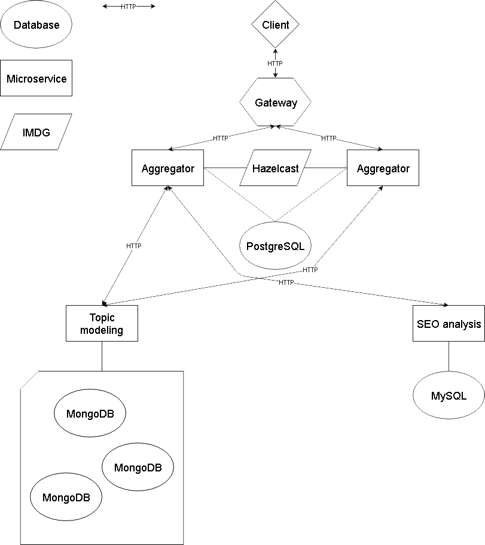

# TCD service architecture

Every microservice uses its own database. Aggregator communicates with other micoservices via REST API.
Aggregator has a replicated instance with distributed cache by Hazelcast IMDG.